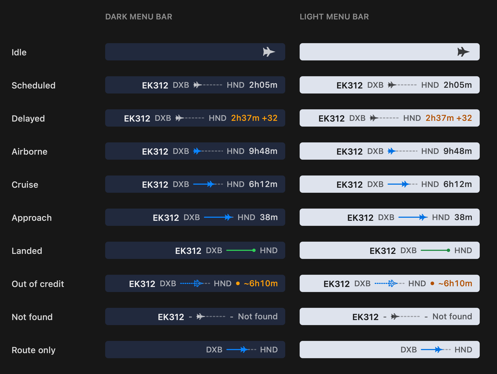
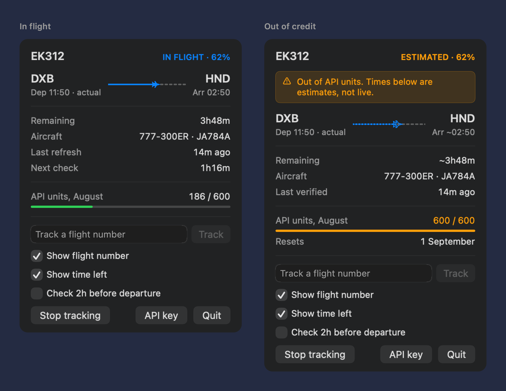

# Hatrack

A flight's progress in the macOS menu bar. Give it a flight number and it draws the journey: origin, a track the aircraft rides, destination, time left. Blue while airborne, green once it's down.



Enter a flight number and pick which day to follow - today out to three days ahead - from a small departure board. Click the item for detail.



## Install

Requires macOS 14+ and the Swift toolchain (Xcode Command Line Tools are enough).

```sh
git clone https://github.com/ksuh90/hatrack.git
cd hatrack
./Scripts/build-app.sh
open Hatrack.app
```

Then click the menu bar item, paste an [AeroDataBox](https://rapidapi.com/aedbx-aedbx/api/aerodatabox) RapidAPI key (free tier), and type a flight number.

The key is stored in your Keychain. Because local builds are ad-hoc signed, macOS asks permission for it again after each rebuild.

## Frugal by design

AeroDataBox's free tier is 600 units a month; a dated status lookup costs 2 and the range call that lists your date options costs 6. Hatrack aims well under that:

- One range call lists the next few days when you add a flight; the day you pick is seeded from it, so choosing costs nothing more
- After that only the picked date is ever re-checked - a dated lookup, never a fresh search
- **Nothing** is spent until the scheduled departure - flights don't leave early
- The first poll fires ten minutes past the scheduled time and either finds it airborne or reads the new estimate and sleeps again; a delay costs one call, not a cadence
- Cruise every 90 minutes, the last 45 minutes every 20, then one call to confirm touchdown

About 12 calls for a long-haul, 6 for a short hop. Between calls the bar interpolates off the clock, so it keeps moving for free. It also tracks its own spend and refuses to exceed the monthly cap - when it does, the bar keeps moving but marks itself estimated, and the dropdown says so.

## Options

Show or hide the flight number and the time left; the route is always drawn. An optional check two hours before departure warns of a delay before you leave for the airport, at one extra call.

If the menu bar is full, macOS parks an oversized item under the notch where it is invisible. Hatrack measures its own placement and drops detail until it fits - time left, then airport codes, then flight number - and restores itself when space returns.

## Development

```sh
swift build
./.build/debug/Hatrack --self-check                  # polling policy, progress maths, input validation
./.build/debug/Hatrack --render-states out.png       # every bar state, both appearances
./.build/debug/Hatrack --render-panel out.png        # the dropdown, offscreen
HATRACK_DEMO=1 ./.build/debug/Hatrack                # a synthetic flight, no API key needed
HATRACK_DIAG=1 ./.build/debug/Hatrack                # log menu bar placement decisions
```

Swapping data providers means writing one `FlightProvider` and changing one line in `Coordinator.provider`; nothing else knows where flights come from.

The screenshots above are generated by the app itself, so they cannot drift from what it actually draws.

## License

MIT
